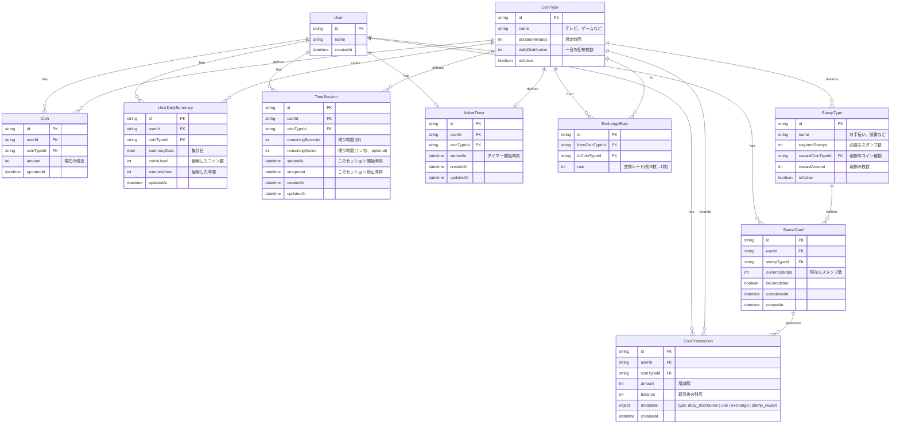

# Kids Coin Manager

- 一日2枚コインが配布される
- 使うボタンで15分テレビがみれる
  - Timer モードに入るか、Timerモードをスキップして減らすだけもできる
  - Timer モードに入った場合、Timer ストップで残り時間をストックもできる
- 5枚でゲームコイン1枚に変えられる
- 両替アリ
- お手伝いパスポートがある。お手伝いを5回、やって集めたスタンプでテレビコイン1枚と交換できる

## Pages

- Main(Root)
  - 今のコイン枚数がわかる
- Timer
  - 利用中コインのタイマー機能
- Stamps
  - お手伝いパスポートのページ
- Manage
  - 管理アカウント側がみれる設定ページ、今は実装しない

## Models

- 将来的に、お手伝いパスポートは管理アカウントで定義をすることができるようにする
- 将来的に、コインの種類とコインの交換レート、設定時間は管理アカウントで定義をすることができるようにする



### TimeSession について

- 時間の残高履歴を管理
- 複数レコード存在可能
- デフラグで統合可能
- `remainingSeconds` と `remainingNanos` で Duration型を表現

### ActiveTimer について

- 実行中のタイマーを管理
- userId + coinTypeId で1レコードのみ
- 実行中のときだけ存在する

### Duration型

```typescript
type Duration = {
  seconds: number
  nanos?: number // ナノ秒（オプショナル）
}
```

protobuf の `google.protobuf.Duration` を参考にした構造体。
TimeSessionでは `remainingSeconds` と `remainingNanos` として保存される。

## Account

- User
- Family
- Role
  - Manager
  - Member

# Use Cases

## MVP

- Session
  - セッション開始時に当日分のコインを配布する
- CoinManage
  - CoinType を追加する
  - CoinType を編集する
- Coin
  - Coin を使う
  - Coin を増やす
- Timer
  - Timerを使う
  - Timerを止める
